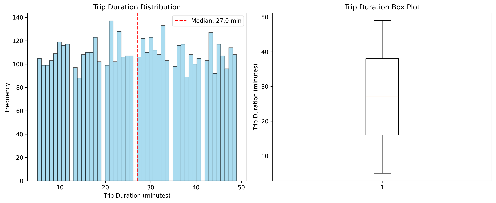
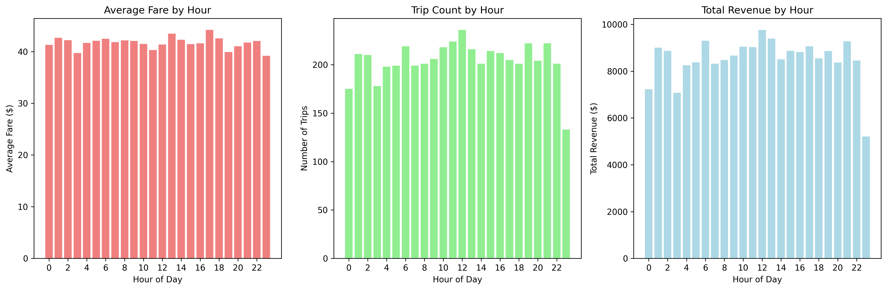
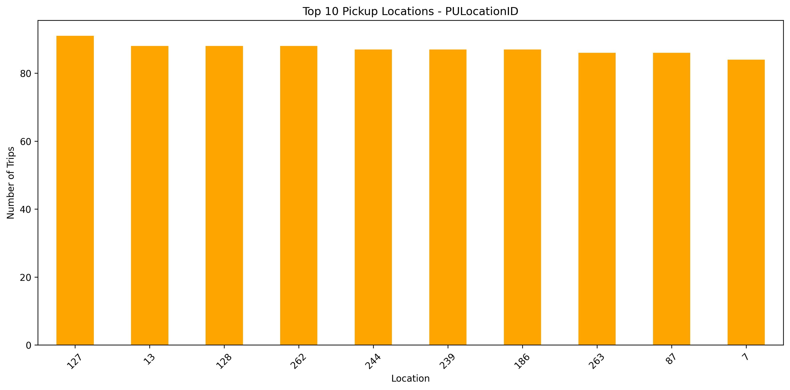
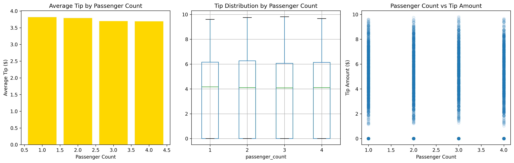
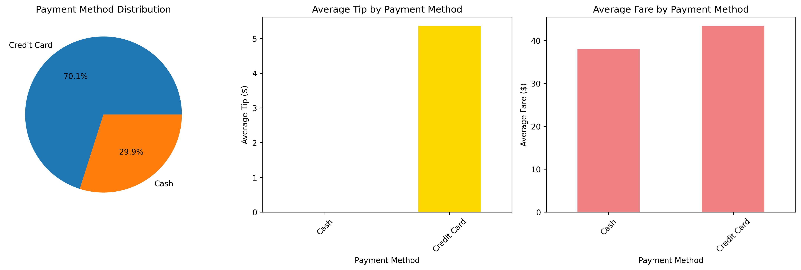
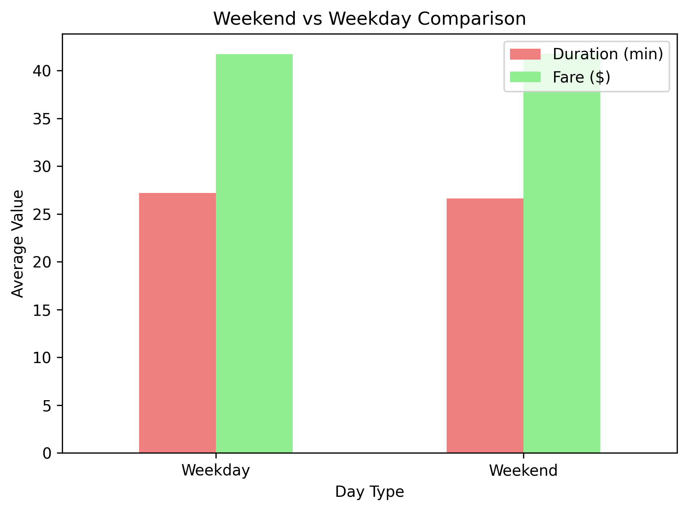
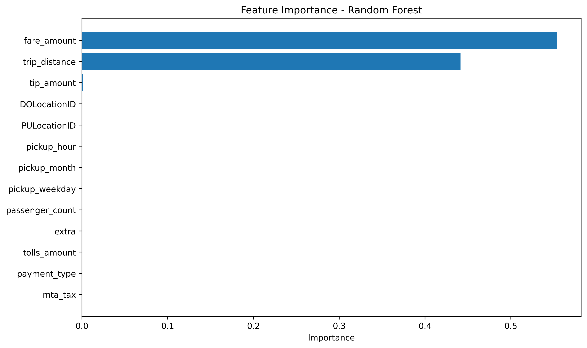
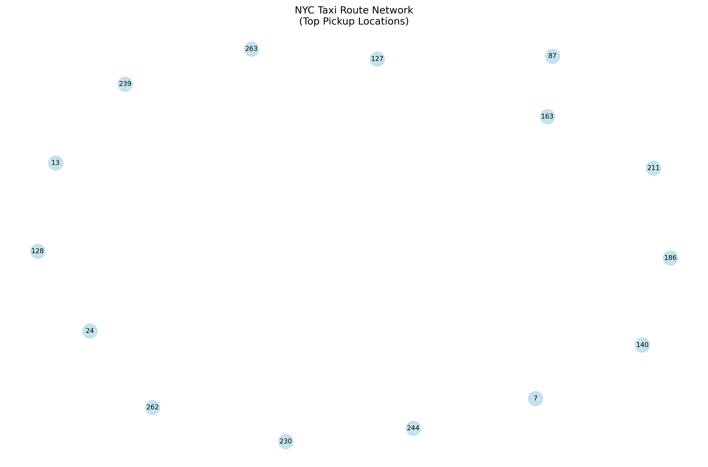
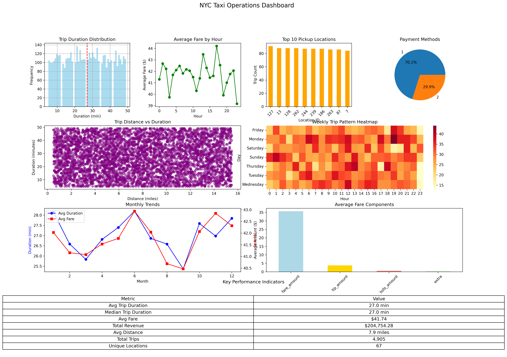

# NYC Taxi Trip Analysis - Delivery Route Assistant

A comprehensive data analysis and machine learning project for NYC Yellow Taxi trip data, featuring exploratory data analysis, predictive modeling, route optimization, and AI-powered insights.

## Overview

This project provides a complete analysis pipeline for NYC taxi trip data, delivering actionable insights for fleet management, revenue optimization, and operational efficiency. The modular architecture ensures maintainability and scalability while providing professional-grade analysis capabilities.

## Project Structure

```
cognizant/
├── main.py                          # Main execution script
├── requirements.txt                  # Python dependencies
├── README.md                        # Project documentation
├── .gitignore                       # Git ignore rules

├── data/                            # Data files
│   └── Cognizant assignment data - NYC Taxi 2023.csv
├── src/                             # Source code
│   ├── __init__.py
│   ├── modules/                     # Analysis modules
│   │   ├── __init__.py
│   │   ├── data_loader.py          # Data loading and preprocessing
│   │   ├── exploratory_analysis.py  # EDA and visualizations
│   │   ├── machine_learning.py     # ML models and predictions
│   │   ├── route_optimization.py   # Graph theory and route optimization
│   │   └── genai_integration.py    # AI-powered analysis
│   └── utils/                       # Utility functions
│       └── __init__.py
├── outputs/                         # Generated files (gitignored)
│   ├── taxi_analysis_cleaned_data.csv
│   ├── taxi_analysis_model.pkl
│   ├── nyc_taxi_pickup_map.html
│   └── visualization files (.png)
├── assets/                          # Visualization examples (included in git)
│   └── (visualization files for documentation)
└── docs/                            # Documentation
```

## Features

### 1. Exploratory Data Analysis (EDA)
- Trip duration distribution analysis
- Revenue patterns by hour and day
- Pickup location distribution
- Passenger-tip relationship analysis
- Payment method analysis
- Time series analysis for demand patterns

### 2. Machine Learning Models
- Trip duration prediction using multiple algorithms
- Feature importance analysis
- Model performance comparison
- Cross-validation and hyperparameter tuning
- Enhanced model analysis with engineered features

### 3. Route Optimization
- Graph-based network analysis
- Shortest path algorithms
- Traveling Salesman Problem (TSP) approximation
- Delivery route optimization
- Network visualization

### 4. Geospatial Analysis
- Interactive mapping with Folium
- Pickup location visualization
- Coordinate-based analysis (when available)

### 5. AI-Powered Insights
- Technical summary generation
- Business recommendation engine
- Risk assessment and implementation roadmap
- Executive summary reports

## Installation

1. Clone the repository and navigate to the project directory
2. Install dependencies: `pip install -r requirements.txt`
3. The data file is included in the repository and will be automatically loaded

## Usage

### Quick Start
```bash
python main.py
```

### Advanced Usage
```python
# Import and run specific analyses
from main import run_quick_analysis, run_full_analysis
run_quick_analysis()  # Quick analysis
df, model_results, ai_report = run_full_analysis()  # Complete pipeline
```

### Output
The analysis generates:
- Preprocessed dataset (`taxi_analysis_cleaned_data.csv`)
- Trained machine learning model (`taxi_analysis_model.pkl`)
- Visualization files (`.png` format)
- Interactive map (`nyc_taxi_pickup_map.html`)


## Business Applications

### Fleet Management
- Optimize driver allocation based on demand patterns
- Reduce idle time through predictive positioning
- Improve customer satisfaction with faster pickup times

### Revenue Optimization
- Implement dynamic pricing during peak hours
- Focus resources on high-revenue locations
- Maximize fare collection through strategic routing

### Delivery Services
- Optimize delivery routes for corporate clients
- Reduce delivery time through intelligent routing
- Scale operations efficiently with predictive analytics

### Operational Efficiency
- Reduce fuel costs through optimized routes
- Improve driver utilization rates
- Enhance customer experience with accurate ETAs

## Customization

### Adding New Features
1. Create new functions in appropriate modules
2. Update imports in main.py
3. Add function calls to the main pipeline

### Modifying Analysis Parameters
- Adjust sample sizes in route optimization
- Change model hyperparameters in machine_learning.py
- Modify visualization settings in exploratory_analysis.py

### Extending AI Integration
- Uncomment OpenAI imports in genai_integration.py
- Add your API key
- Customize prompts for specific business needs

## Output Files

### Data Files
- `outputs/taxi_analysis_cleaned_data.csv`: Preprocessed dataset
- `outputs/taxi_analysis_model.pkl`: Trained machine learning model

### Visualizations
- `outputs/trip_duration_distribution.png`: Duration analysis
- `outputs/revenue_patterns.png`: Revenue by hour
- `outputs/pickup_distribution.png`: Location analysis
- `outputs/passenger_tip_relationship.png`: Tip analysis
- `outputs/payment_analysis.png`: Payment methods
- `outputs/time_series_analysis.png`: Temporal patterns
- `outputs/feature_importance.png`: ML feature importance
- `outputs/network_visualization.png`: Route network
- `outputs/dashboard.png`: Comprehensive dashboard

### Interactive Files
- `outputs/nyc_taxi_pickup_map.html`: Interactive map (if coordinates available)

## Requirements

- Python 3.8+
- 4GB RAM minimum
- Key libraries: pandas, numpy, matplotlib, seaborn, scikit-learn, networkx, folium
- See `requirements.txt` for complete dependencies

## Troubleshooting

- **Data file not found**: Ensure the CSV file is in the `data/` directory
- **Missing dependencies**: Run `pip install -r requirements.txt`
- **Memory issues**: Close other applications or reduce sample size
- **Visualization errors**: Check matplotlib backend configuration


## Contributing

1. Fork the repository
2. Create a feature branch
3. Make your changes following PEP 8 guidelines
4. Add tests for new functionality
5. Submit a pull request

## License

This project is for educational and research purposes. Please ensure compliance with data usage agreements when working with NYC taxi data.

## Support

For questions or issues, please check the troubleshooting section or create an issue with detailed error information.


## Analysis Results & Visualizations

Here are the actual visualizations generated by our analysis:

### Trip Duration Analysis

*Distribution of trip durations showing peak around 10-20 minutes*

### Revenue Patterns

*Revenue patterns by hour showing peak periods*

### Pickup Location Analysis

*Top pickup locations for strategic driver positioning*

### Passenger-Tip Relationship

*Analysis of passenger count vs tip amounts*

### Payment Method Analysis

*Distribution of payment methods used by passengers*

### Time Series Analysis

*Temporal patterns in taxi demand*

### Machine Learning Feature Importance

*Key features that influence trip duration predictions*

### Route Optimization Network

*Graph-based network analysis for route optimization*

### Comprehensive Dashboard

*Complete analysis dashboard with key insights*

 